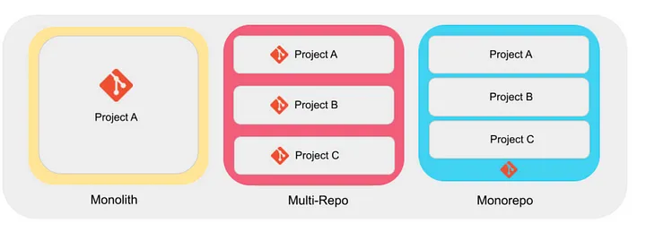

## What is a Monorepo?

A Monorepo is a version-controlled code repository that refers to managing multiple projects in a single codebase, which helps simplify the complexity of code sharing, version control, construction, and deployment. While these projects may be related, they are often logically independent and run by different teams.

### Monorepo history

- Stage one: Monolithic architecture  
A monolithic architecture exists at the very early stage of your project. It has two main features. One code base, it is managed by only one git repo. Coupled, all features, utils and services are coupled.
  - advantages: due to the simplicity of one code base, easy to develop, deploy and debug.
  - disadvantages: appear as the application grows bigger and bigger. Making a small change requires compiling, deploying and testing the entire project. Low scalability and low flexibility.

- Stage two: MultiRepo  
  The multi-repo approach uses several repositories to host the multiple libraries or services of a project developed by a company.
  - advantages: code separately, independent library version, independent service releases
  - disadvantages: hard to share resources, such as components, configs, utils, and test suites; need publish separately and manually manage the versions of these dependencies. increased risk of code changes by non-owners. increased risk of code duplication.

- Stage three: MonoRepo
  - advantages: easy to share resources and manage dependencies; independent and flexible, package itself can have its own dependencies as well as shared dependencies.Coding Styles
  - disadvantages: slow git pull, git repo grows bigger and bigger; deploy coupled



### Monorepo Solution
- Lerna is a tool for managing JavaScript projects with multiple packages, built on Yarn.
- Turborepo is a high-performance build system for JavaScript and TypeScript codebases.
- pnpm is a JavaScript dependency management tool that supports monorepos through a set of dedicated commands called pnpm multi.
  - In pnpm, packages are always reused if they are already installed for another project saving a lot of disk space which makes it faster and more efficient than npm.

### Set up with pnpm
1. Install pnpm
   ```npm install -g pnpm```
2. Initialize a new pnpm workspace  
   create a new folder named `pnpm-mono`, cd into it and then run `pnpm init` to generate a top-level `package.json`. This will be the root `package.json` for our PNPM monorepo.
3. Create a `pnpm-workspace.yaml` file at the root of the repository, defining the monorepo structure
   ```
   packages:
     - packages/*
   ```
   This configuration instructs pnpm to look for all projects under the folder named packages
4. Enable the pnpm workspaces feature in the `package.json` file in the root directory
   ```
   {
        "name": "monorepo-demo",
        "private": true,
        "workspaces": {
            "packages": ["packages/*"]
        }
    }
   ```
5. Create sub projects, under the packages directory
6. To add a local dependency within a monorepo, in your `package.json`
   ```
   "dependencies":{
        "shared": "workspace:*" // (where '*' means "any version")
    }
   ```
7. Install dependencies  
   All packages can use the dependency if it is installed in the root directory. How do we install a dependency for a specific package?  
   `pnpm --filter <package_selector> <command>`, such as `pnpm --filter @packages/shared add lodash`
8. if PackageA refers to packageB
   `pnpm --filter @packages/A add @packages/B@*`, `@*` denotes the latest version is synchronized by default