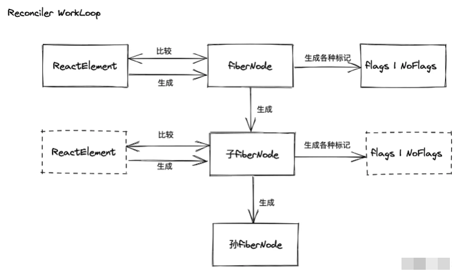

## reconciler
在React中，Reconciler​（协调器）是负责管理虚拟DOM树更新的关键部分。当组件状态或属性发生更改时，Reconciler的任务是确定如何有效地更新DOM来反映这些更改。这个过程通常被称为 "协调"（Reconciliation）。

Reconciler​的核心思想是通过将新的虚拟DOM树与旧的虚拟DOM树进行比较，找出需要实际更新的部分，然后最小化实际DOM操作的数量。这个过程被称为"diff"算法

### 传统库与现代框架的工作原理

在传统的库（jQuery）工作原理（过程驱动）
- jQuery工作原理，过程驱动：jQuery -> 调用 -> 宿主环境API -> 显示 -> 真实UI

在传统的前端开发中使用的jQuery​库的工作原理主要是通过一个简化和统一的API，使得开发者能够更容易地操作DOM、处理事件、创建动画以及发起AJAX请求等。而不是描述UI的状态。所以jQuery的工作原理是过程驱动的。

前端框架结构与工作原理（状态驱动）

现代的前端框架结构与工作原理

在现代的前端框架中，开发者使用描述UI的方法（template或JSX）来定义组件和它们之间的关系。
运行时核心模块根据描述的UI，管理组件的创建、更新和销毁，处理数据状态变更，并通过虚拟DOM或响应式系统来优化UI更新性能。
当需要与宿主环境交互时（如操作DOM、处理事件或发起网络请求），运行时核心模块会调用宿主环境API。前端框架通常会封装这些API，提供统一的跨平台接口。

react:
- 消费jsx
- 没有编译优化
- 开放通用API供不同宿主环境使用

核心模块消费jsx的过程
- 核心模块操作的数据结构是？
  当前已知的数据结构：React Element 
  React Element如果作为核心模块操作的数据结构，存在问题：
  - 无法表达节点之间的关系
  - 字段有限，无法表达状态
- 需要一种新的数据结构 FiberNode（虚拟DOM在React中的实现），特点
  - 介于React Element与真实UI节点之间
  - 能够表达节点之间的关系
  - 方便拓展（不仅作为数据存储单元，也能作为工作单元）
- 节点类型：
  - JSX
  - React Element
  - FiberNode
  - DOM Element

reconciler的工作方式

- 对于同一个节点，比较其React Element与fiberNode，生成子fiberNode。并根据比较的结果生成不同标记（插入，删除，移动），对应不同宿主环境API的执行。

当所有React Element比较完后，会生成一棵FiberNode树，一共会存在两棵FiberNode树：
- current: 与视图中真实UI对应的FiberNode树
- workInProgress: 触发更新后，正在reconciler中计算的FiberNode树

这就是React中的"双缓存树"技术, React 中使用"双缓存"来完成Fiber Tree的构建与替换，对应着DOM Tree的创建于与更新。current Fiber树中的Fiber节点被称为current fiber，workInProgress Fiber树中的Fiber节点被称为workInProgress fiber，他们通过alternate属性连接。

JSX消费的顺序
- 以DFS（深度优先遍历）的顺序遍历React Element，意味着：
  - 如果有子节点，遍历子节点
  - 如果没有子节点，遍历兄弟节点

递：对应beginWork
归：对应completeWork