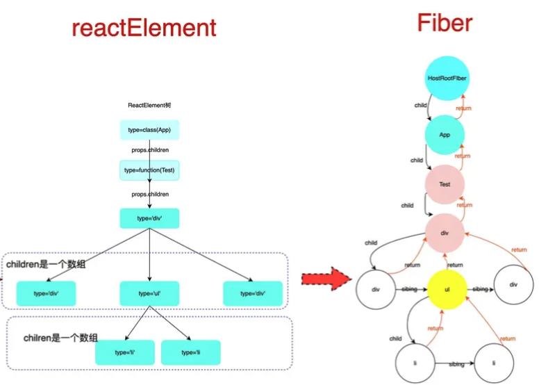
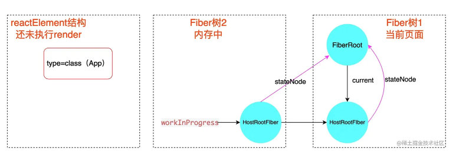

## Fiber

React15架构的缺点：
在组件初始化或者更新的时候，会递归更新子组件。 由于是递归执行，所以更新一旦开始，中途就无法中断。 当组件层级很深时，递归更新时间超过了16.6ms（主流浏览器每16.6ms刷新一次），用户交互界面就会卡顿，用户体验较差。

- 在Reconciler中，mount的组件会调用mountComponent，update的组件会调用updateComponent。这两个方法都会递归更新子组件。
- Stack reconciler(协调器)：找出变化的组件
  1. 调用函数组件，或class组件的render方法，将返回的jsx转化为虚拟DOM
  2. 将虚拟DOM和上次更新时的虚拟DOM对比
  3. 通过对比找出本次更新中变化的虚拟DOM
  4. 通知Renderer将变化的虚拟DOM渲染到页面上
  - 同步更新  ->  由于递归更新，无法中断，更新时间超过16ms, 出现卡顿
- Renderer(渲染器)：负责将变化的组件渲染到页面上

React16架构
- 可中断异步更新
- Scheduler 调度器：调度任务的优先级，高优任务优先进入Reconciler
- Fiber reconciler 协调器：负责找出变化的组件
  1. 支持任务不同优先级，可中断与恢复，并且恢复后可以复用之前的中间状态
  2. 任务更新单元为React Element对应的Fiber节点
  3. 没有采用Generator实现协调器，自己实现了一套异步可中断更新机制
  4. Fiber取代React16虚拟DOM的叫法
- Renderer渲染器：将变化的组件渲染到页面上

Fiber节点组成：
- 静态的数据结构：每个Fiber节点对应一个React element，保存了该组件的类型，对应的DOM节点等信息
  - tag, key, elementType, type, stateNode
- 连接其他Fiber节点形成Fiber树的属性
  - return: 指向父级Fiber节点，return指节点执行完completeWork后会返回的下一个节点。 child：指向子Fiber节点。sibling：指向右边第一个兄弟Fiber节点
- 作为动态的工作单元的属性：每个Fiber节点保存了本次更新中该组件改变的状态，要执行的工作（被删除，被插入，被更新）
  - pendingProps, memoizedProps, updateQueue, memoizedState
- 调度优先级相关属性
  - lanes, childLanes
- 指向该fiber在另一次更新时对应的fiber属性
  - alternate


### Fiber 对象
一个Fiber对象代表一个即将渲染或者已经渲染的组件(ReactElement), 一个组件可能对应两个fiber(current和WorkInProgress)

React Fiber 就是采用链表实现的。每个 Virtual DOM 都可以表示为一个 fiber，如下图所示，每个节点都是一个 fiber。一个 fiber包括了 child（第一个子节点）、sibling（兄弟节点）、return（父节点）等属性，React Fiber 机制的实现，就是依赖于以下的数据结构


```
class FiberNode {
  constructor(tag, pendingProps, key, mode) {
    // 实例属性
    this.tag = tag; // 标记不同组件类型，如函数组件、类组件、文本、原生组件...
    this.key = key; // react 元素上的 key 就是 jsx 上写的那个 key ，也就是最终 ReactElement 上的
    this.elementType = null; // createElement的第一个参数，ReactElement 上的 type
    this.type = null; // 表示fiber的真实类型 ，elementType 基本一样，在使用了懒加载之类的功能时可能会不一样
    this.stateNode = null; // 实例对象，比如 class 组件 new 完后就挂载在这个属性上面，如果是RootFiber，那么它上面挂的是 FiberRoot,如果是原生节点就是 dom 对象
    // fiber
    this.return = null; // 父节点，指向上一个 fiber
    this.child = null; // 子节点，指向自身下面的第一个 fiber
    this.sibling = null; // 兄弟组件, 指向一个兄弟节点
    this.index = 0; //  一般如果没有兄弟节点的话是0 当某个父节点下的子节点是数组类型的时候会给每个子节点一个 index，index 和 key 要一起做 diff
    this.ref = null; // reactElement 上的 ref 属性

    this.pendingProps = pendingProps; // 新的 props, 从`ReactElement`对象传入的 props. 用于和`fiber.memoizedProps`比较可以得出属性是否变动
    this.memoizedProps = null; // 旧的 props, 上一次生成子节点时用到的属性, 生成子节点之后保持在内存中

    this.updateQueue = null; // fiber 上的更新队列执行一次 setState 就会往这个属性上挂一个新的更新, 每条更新最终会形成一个链表结构，最后做批量更新
    this.memoizedState = null; // 对应  memoizedProps，上次渲染的 state，相当于当前的 state，理解成 prev 和 next 的关系
    this.mode = mode; // 表示当前组件下的子组件的渲染方式

    // flags
    this.flags: Flags, // 标志位
    this.subtreeFlags: Flags, //替代16.x版本中的 firstEffect, nextEffect. 当设置了 enableNewReconciler=true才会启用
    this.effectTag = NoEffect; // 表示当前 fiber 要进行何种更新（更新、删除等）

    // effects
    this.nextEffect = null; // 指向下个需要更新的fiber
    this.firstEffect = null; // 指向所有子节点里，需要更新的 fiber 里的第一个
    this.lastEffect = null; // 指向所有子节点中需要更新的 fiber 的最后一个
    this.expirationTime = NoWork; // 过期时间，代表任务在未来的哪个时间点应该被完成
    this.childExpirationTime = NoWork; // child 过期时间
    
    this.alternate = null; // current 树和 workInprogress 树之间的相互引用
  }
}
```

### Example

```
function App() {
  return (
    <div className="App">
      <header>header</header>
      <Content />
      <footer>footer</footer>
    </div>
  );
}

function Content() {
  return (
      <React.Fragment>
        <p>1</p>
        <p>2</p>
      </React.Fragment>
  );
}
export default App;
```


### React16中使用了 Fiber，但是 Vue 是没有 Fiber 的，为什么呢？原因是二者的优化思路不一样：

- Vue 是基于 template 和 watcher 的组件级更新，把每个更新任务分割得足够小，不需要使用到 Fiber 架构，将任务进行更细粒度的拆分
- React 是不管在哪里调用 setState，都是从根节点开始更新的，更新任务还是很大，需要使用到 Fiber 将大任务分割为多个小任务，可以中断和恢复，不阻塞主进程执行高优先级的任务

### ReactElement, Fiber, DOM

```
// jsx
function Test() {
  const [show, setShow] = useState(true);
  return (
    <div>
      <div>header</div>
      <ul>
        <li>Number 1</li>
        {show && <li>Number 2</li>}
      </ul>
      <div onClick={() => { setShow(false);}}> click </div>
    </div>
  );
}
```



在react初始化的时候，会创建三个全局对象，在三个对象创建完毕的时候，react初始化完毕
- ReactDOMRoot对象：属于react-dom包，该对象暴露有render,unmount方法, 通过调用该实例的ReactDOM.render方法, 可以引导 react 应用的启动.
- fiberRoot对象：
  - 属于react-reconciler包,在运行过程中的全局上下文, 保存 fiber 构建过程中所依赖的全局状态
  - 大部分实例变量用来存储fiber构造循环过程的各种状态，react 应用内部, 可以根据这些实例变量的值, 控制执行逻辑
- HostRootFiber对象
  - 属于react-reconciler包，这是 react 应用中的第一个 Fiber 对象, 是 Fiber 树的根节点, 节点的类型是HostRoot

fiber 树构造方式
1. 初次创建: 在React应用首次启动时, 界面还没有渲染, 此时并不会进入对比过程, 相当于直接构造一棵全新的树.
2. 对比更新: React应用启动后, 界面已经渲染. 如果再次发生更新, 创建新fiber之前需要和旧fiber进行对比. 最后构造的 fiber 树有可能是全新的, 也可能是部分更新的.



